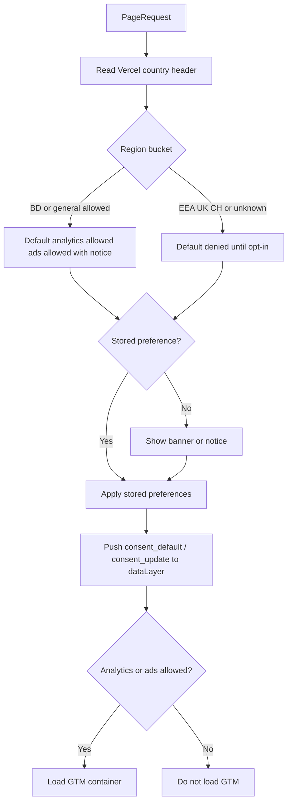

# Spec: Analytics System (GTM-First)

## Objective

Replace the current fragmented direct GA4 + Facebook Pixel implementation with an industry-standard, GTM-first analytics stack that supports:

- **Traffic analysis** — page views, locale, acquisition, engagement on key school pages.
- **Ad readiness** — Meta Pixel, GA4 key events, and Google Ads-ready conversion linker / key-event import via GTM.
- **UX insight** — Microsoft Clarity session recordings with form masking on sensitive flows.
- **Lead funnel measurement** — pre-admission submit as primary conversion; secondary events for downloads, CTAs, contact attempts, and language changes.

**Primary users:** school marketing/admin staff (GTM, GA4, Meta Ads, Clarity dashboards) and developers maintaining the `dataLayer` contract.

**Success looks like:** marketers configure tags in GTM without code deploys; developers push typed, PII-safe events from the app; consent and region rules are enforced before tags load; conversion funnels are measurable end-to-end for admission campaigns.

---

## Current State (Audit)

| Area | Today | Gap |
|------|-------|-----|
| Loading | Direct GA4 + Meta Pixel via `next/script` in root layout | No GTM, no Clarity |
| Consent | Banner exists but scripts load before accept | Not enforced |
| Events | Broad `InteractionTracker` (all clicks); helpers in `analytics.ts` unused | No wired conversions |
| Env | `NEXT_PUBLIC_GTM_ID`, `NEXT_PUBLIC_CLARITY_ID` documented but unused | Env drift |
| Privacy | Banner links to `/privacy-policy` (route missing) | Legal UX incomplete |
| Contact form | Simulated submit (no backend) | Cannot count success conversion |
| Downloads | Server `console.log` only | No client/GTM events |
| Duplication | GA initialized via `next/script` **and** `initializeAnalytics()` DOM injection | Double-load risk |

**Files to replace/refactor:**

- [`src/app/layout.tsx`](../../src/app/layout.tsx) — remove `GoogleAnalytics`, `FacebookPixel`, `CookieConsent`, `InteractionTracker`
- [`src/components/analytics/google-analytics.tsx`](../../src/components/analytics/google-analytics.tsx) — retire or replace
- [`src/components/analytics/facebook-pixel.tsx`](../../src/components/analytics/facebook-pixel.tsx) — retire
- [`src/lib/analytics.ts`](../../src/lib/analytics.ts) — replace with GTM `dataLayer` contract

---

## Locked Architecture Decisions

| Decision | Choice |
|----------|--------|
| Tag architecture | **GTM-first** — app loads GTM + pushes `dataLayer`; GA4, Meta Pixel, Clarity, Google Ads tags live in GTM |
| Hosting / geo | **Vercel** — read `x-vercel-ip-country` (and related headers) for region-aware consent |
| Consent model | **Region-aware** — BD/general: analytics allowed by default with notice; EEA/UK/CH + unknown: opt-in fallback |
| Region detection | **Free custom resolver** — no paid CMP; conservative fallback when country unknown |
| App env contract | **`NEXT_PUBLIC_GTM_ID` only** at runtime; GA4/Meta/Clarity/Ads IDs configured in GTM + documented |
| GTM integration | **`next/script` + custom consent gating** — no `@next/third-parties` dependency |
| Legacy code | **Replace** direct GA/Pixel layer with clean GTM/dataLayer module |
| GTM UI setup | **Code + docs** — implementation includes exact GTM checklist; marketer configures container manually |
| Conversion scope | **Full school funnel** (see Event Taxonomy) |
| Data boundary (v1) | **No PII** in analytics payloads; enhanced matching documented as v2 after policy + consent + approval |
| Student data | **Safe funnel metadata only** — locale, page, CTA source, form type, success/failure, broad program category |
| Clarity | **All pages** via GTM; **mask/block** admission and contact form areas |
| Clarity consent | **Analytics category** — same rules as GA4 for region/consent |
| Ad platforms (v1) | Meta Pixel + GA4 + **Google Ads-ready** notes (conversion linker, key event import) |
| Meta mapping | Standard events: `PageView`, `Lead`, `Contact`, `SubmitApplication`, `ViewContent` + safe custom params |
| Attribution | **Persist** first/last-touch UTM + `gclid`/`fbclid` when consent/region allows; attach to conversions |
| Internal storage | Store safe attribution with submissions (Sheets) when allowed |
| Conversion values | **No monetary values in v1** — use key events + optional `lead_priority` param |
| Contact form | Track `form_start` / `form_attempt`; **no success conversion** until real backend exists |
| Pre-admission | **`generate_lead` / `SubmitApplication` only on successful Google Sheets response** |
| Privacy UX | Bilingual banner + manage preferences (analytics vs ads categories) + bilingual policy pages |
| Enhanced matching | **v2 only** — after privacy policy, explicit marketing consent, legal/admin approval |

---

## Tech Stack

| Layer | Technology |
|-------|------------|
| Framework | Next.js 16 App Router, React 19 |
| i18n | next-intl (`bengali`, `english` locales) |
| Tag manager | Google Tag Manager (client-side) |
| Analytics | GA4 (via GTM) |
| Ads | Meta Pixel (via GTM); Google Ads conversion linker (via GTM) |
| Session replay | Microsoft Clarity (via GTM) |
| Hosting | Vercel (geo headers) |
| Testing | Vitest (unit), Playwright (e2e smoke + analytics assertions) |

---

## Commands

```bash
# Development
pnpm dev

# Unit tests (analytics tests will live under src/lib/analytics*.test.ts)
pnpm test
pnpm test:watch

# Lint
pnpm lint

# Production build
pnpm build
pnpm start

# E2E (port 3100)
pnpm test:e2e
```

---

## Project Structure

```
src/
├── app/
│   ├── layout.tsx                    # Mount AnalyticsProvider (replaces legacy components)
│   └── [locale]/
│       ├── privacy-policy/page.tsx   # New — bilingual privacy policy
│       └── cookie-policy/page.tsx    # New — bilingual cookie/analytics policy
├── components/
│   └── analytics/
│       ├── analytics-provider.tsx    # GTM script + consent gate + route pageviews
│       ├── consent-banner.tsx        # Bilingual banner + preference center
│       └── clarity-mask.tsx          # data-clarity-mask wrappers for form areas
└── lib/
    ├── analytics/
    │   ├── types.ts                  # DataLayer event types
    │   ├── events.ts                 # Event builders (PII-safe)
    │   ├── consent.ts                # Region + preference resolver
    │   ├── attribution.ts            # UTM/gclid/fbclid persistence
    │   ├── push.ts                   # dataLayer.push wrapper
    │   └── index.ts                  # Public API
    ├── analytics.test.ts             # Unit tests
    └── analytics-consent.test.ts

docs/analytics/
├── analytics-spec.md                 # This file
├── analytics-task-breakdown.md       # Implementation tasks
└── gtm-setup-checklist.md            # Created during implementation (GTM UI steps)

e2e/
└── analytics.spec.ts                 # Playwright checks (mocked dataLayer)
```

---

## Code Style

Conventions match existing project patterns: `@/*` imports, client components only where needed, bilingual copy via `next-intl` or inline locale objects for policy pages.

```typescript
// src/lib/analytics/events.ts — example event builder
import type { SafeAnalyticsEvent } from './types';

export function buildGenerateLead(params: {
  formType: 'pre_admission';
  locale: string;
  pagePath: string;
  ctaSource?: string;
  programCategory?: string;
  attribution?: SafeAttribution;
}): SafeAnalyticsEvent {
  return {
    event: 'generate_lead',
    form_type: params.formType,
    locale: params.locale,
    page_path: params.pagePath,
    cta_source: params.ctaSource ?? null,
    program_category: params.programCategory ?? null,
    ...params.attribution,
  };
}
```

**Naming:**

- `dataLayer` events: `snake_case` GA4-style names (`generate_lead`, `file_download`, `form_start`).
- Module files: `kebab-case` paths under `src/lib/analytics/`.
- Consent storage key: `mq-analytics-consent-v1` (versioned JSON object, not plain string).
- Never pass `name`, `email`, `phone`, `message`, filenames, stack traces, or full `userAgent` to `dataLayer`.

---

## Event Taxonomy

### Automatic / global

| Event | When | Key params |
|-------|------|------------|
| `consent_default` | Before GTM loads | `analytics_storage`, `ad_storage`, `region`, `consent_mode` |
| `consent_update` | User changes preferences | `analytics_storage`, `ad_storage` |
| `page_view` | SPA route change (pathname + search) | `page_path`, `page_title`, `locale` |

### Conversions (primary)

| Event | When | GA4 | Meta |
|-------|------|-----|------|
| `generate_lead` | Pre-admission Google Sheets **success** | Key event | `SubmitApplication` + `Lead` |
| `form_start` | User begins pre-admission form | Engagement | — |
| `form_submit` | Pre-admission submit **failure** only | Error tracking | — |

### Secondary funnel

| Event | When | Notes |
|-------|------|-------|
| `file_download` | Prospectus, curriculum, code-of-conduct PDF | `file_category`: `prospectus` \| `curriculum` \| `code_of_conduct` |
| `click_to_call` | `tel:` link click | `cta_location` |
| `click_to_email` | `mailto:` link click | `cta_location` |
| `click_to_whatsapp` | WhatsApp support link | `cta_location` |
| `outbound_click` | External link (e.g. books site) | `link_domain` |
| `language_change` | Locale toggle | `from_locale`, `to_locale` |
| `view_content` | Key landing sections (optional) | `content_type`, `content_id` |
| `form_start` | Contact form opened / first field focus | `form_type`: `contact_general` \| `contact_admission` \| `contact_feedback` |
| `form_attempt` | Contact or admission inquiry form submit clicked | **Not** `generate_lead` until backend exists |

### Removed (do not carry forward)

- Global `button_click` / `link_click` auto-tracking (`InteractionTracker`)
- `trackUserDemographics` with full `userAgent`
- UA-style `event_category` / `event_label` params
- Duplicate GA script injection via `initializeAnalytics()`

### Safe attribution params (attached when allowed)

```
utm_source, utm_medium, utm_campaign, utm_content, utm_term
gclid_present (boolean), fbclid_present (boolean)
landing_page, referrer_domain
attribution_model: 'first_touch' | 'last_touch'
```

---

## Consent Model



**Region buckets (v1):**

| Bucket | Countries | Default |
|--------|-----------|---------|
| `general` | BD + non-regulated (configurable list) | Analytics + ads allowed; show informational notice with link to preferences |
| `regulated` | EEA, UK, CH (ISO list in code) | Denied until explicit opt-in |
| `unknown` | Missing/unparseable geo header | Treat as `regulated` (conservative) |

**Preference categories:**

1. **Analytics** — GA4, Clarity
2. **Advertising** — Meta Pixel, Google Ads tags

**Storage:** `localStorage['mq-analytics-consent-v1']` — JSON `{ analytics: boolean, advertising: boolean, updatedAt: ISO string }`.

**Re-open preferences:** Footer link “Cookie preferences” / Bengali equivalent.

---

## Privacy Rules

### Never send to `dataLayer` or third-party tags

- Names (student, guardian, staff)
- Email, phone, address
- Form message content
- Uploaded file names or URLs with identifiable paths
- Exact age, class, or free-text assessment answers
- Full `navigator.userAgent` or error stack traces

### Allowed metadata

- `locale`, `page_path`, `form_type`, `success` / `failure`
- Broad `program_category` (e.g. `pre_hifz`, `hifz`) if already a form enum — not free text
- `cta_source` (e.g. `hero`, `admission_banner`, `footer`)
- Safe attribution fields (see above) when consent allows

### Clarity masking

- Wrap pre-admission form, contact forms, and any PII-capable inputs with `data-clarity-mask="true"` or Clarity’s `clarity-mask` class on containers.
- Document in GTM checklist: enable Clarity default masking; verify masked fields in Clarity dashboard before go-live.

### Policy pages

- `/[locale]/privacy-policy` — bilingual; sections on data collected, analytics tools, children’s data, contact for privacy requests.
- `/[locale]/cookie-policy` — tool list (GTM, GA4, Meta, Clarity), retention, how to change preferences.
- Placeholder disclaimer: *“Review by legal counsel recommended before production.”*

### Enhanced matching (v2 — out of scope for v1)

Document only. Requires: updated privacy policy, explicit marketing consent UI, admin approval, hashed email/phone never stored in plain text in analytics.

---

## GTM Setup Notes (Manual — Marketer)

> Full step-by-step checklist will live in [`gtm-setup-checklist.md`](./gtm-setup-checklist.md) after implementation. Summary for planning:

### Container

1. Create GTM web container; set `NEXT_PUBLIC_GTM_ID=GTM-XXXXXXX` in Vercel env.
2. **Consent Overview** — enable Consent Mode; map `analytics_storage` and `ad_storage` to consent variables fed by `dataLayer` events.

### Tags (v1)

| Tag | Type | Trigger |
|-----|------|---------|
| GA4 Configuration | Google Tag | Consent granted (analytics) + All Pages |
| GA4 Event tags | GA4 Event | Custom Event triggers per `dataLayer` event name |
| Meta Pixel Base | Custom HTML or Meta template | Consent granted (advertising) + All Pages |
| Meta standard events | Custom Event | `generate_lead`, etc. |
| Microsoft Clarity | Custom HTML | Consent granted (analytics) + All Pages |
| Google Ads Conversion Linker | Conversion Linker | Consent granted (advertising) + All Pages |

### Variables

- Data Layer Variables for each safe param (`locale`, `form_type`, `page_path`, UTM fields, etc.).
- Consent state variables from `consent_default` / `consent_update`.

### Triggers

- Custom Event: `page_view`, `generate_lead`, `file_download`, `form_start`, `form_attempt`, `click_to_call`, `language_change`, `outbound_click`, etc.

### GA4 Admin

- Mark `generate_lead` as **Key event**.
- Link Google Ads account; import `generate_lead` when Ads account is ready.

### Meta Events Manager

- Verify `SubmitApplication` and `Lead` from test browser; use Test Events tool.

### Clarity

- Create project; paste ID into GTM tag.
- Confirm recordings respect masks on `/pre-admission` and `/contact`.

### Do NOT configure in app code

- GA4 Measurement ID (`G-XXXX`)
- Meta Pixel ID
- Clarity Project ID
- Google Ads conversion ID/label

These stay in GTM only.

---

## Testing Strategy

| Level | Framework | Scope |
|-------|-----------|-------|
| Unit | Vitest + jsdom | Consent region resolver, attribution persistence rules, event builders (no PII), sanitization |
| Integration | Vitest | `pushToDataLayer` with mocked `window.dataLayer` |
| E2E | Playwright | GTM stub loaded, consent banner behavior, `generate_lead` on mocked form success |
| Manual | GTM Preview + GA4 DebugView + Meta Test Events + Clarity | Pre-launch verification |

**Coverage expectation:** All new `src/lib/analytics/*` modules have unit tests; critical consent paths have ≥1 test per region bucket.

**Prove-It pattern for bugs:** Reproduce with failing test before fix.

---

## Boundaries

### Always do

- Run `pnpm test` before merging analytics changes.
- Push events through `src/lib/analytics/push.ts` only — single choke point for sanitization.
- Gate GTM script on consent resolver output.
- Use bilingual strings for consent UI and policy pages.
- Attach attribution only when `canPersistAttribution(consent, region)` returns true.

### Ask first

- Adding new `dataLayer` events beyond the taxonomy (update spec first).
- Storing new fields in Google Sheets for attribution.
- Enabling enhanced matching (v2).
- Adding paid CMP or new analytics dependencies.
- Tracking new pages with Clarity without mask review.

### Never do

- Commit real GTM/GA4/Meta/Clarity IDs to the repo (use env + GTM UI).
- Send PII or child-identifiable data to `dataLayer` or third parties.
- Load GTM before consent state is resolved.
- Keep duplicate GA/Pixel direct scripts alongside GTM.
- Count contact form simulated success as `generate_lead`.
- Remove failing analytics tests without approval.

---

## Success Criteria

- [ ] `NEXT_PUBLIC_GTM_ID` is the only analytics-related **required** app env var at runtime.
- [ ] Legacy `GoogleAnalytics`, `FacebookPixel`, `InteractionTracker`, and duplicate `initializeAnalytics()` paths removed from production layout.
- [ ] GTM loads only when consent resolver allows analytics and/or advertising.
- [ ] `page_view` fires on locale route changes with `locale` param.
- [ ] `generate_lead` fires **once** per successful pre-admission Sheets submission with safe params + attribution when allowed.
- [ ] Contact forms emit `form_start` / `form_attempt` but **not** `generate_lead`.
- [ ] Download buttons emit `file_download` with correct `file_category`.
- [ ] Phone/email/WhatsApp/outbound/language events fire from targeted handlers (not global click listener).
- [ ] Clarity mask attributes present on pre-admission and contact form containers.
- [ ] Bilingual privacy and cookie policy pages exist; consent banner links resolve.
- [ ] Bilingual consent banner with analytics/ads preference toggles persists choice.
- [ ] Regulated/unknown regions default to denied until opt-in.
- [ ] BD/general regions get notice + default-allowed behavior per spec.
- [ ] Safe attribution stored with Sheets submission when allowed.
- [ ] `pnpm test`, `pnpm lint`, `pnpm build` pass.
- [ ] GTM setup checklist document exists for marketer handoff.
- [ ] No PII in unit test fixtures or example `dataLayer` payloads.

---

## Open Questions / Operational Prerequisites

| Item | Owner | Status |
|------|-------|--------|
| GTM container created | Marketing / admin | Required before prod |
| GA4 property + web data stream | Marketing | Configure in GTM |
| Meta Pixel + Events Manager access | Marketing | Configure in GTM |
| Microsoft Clarity project | Marketing | Configure in GTM |
| Google Ads account (optional v1) | Marketing | Link later via GA4 import |
| Legal review of policy page copy | School admin | Recommended before launch |
| Vercel env: `NEXT_PUBLIC_GTM_ID` | DevOps | Required for prod |
| Remove deprecated env vars from `.env.local.example` after migration | Dev | During implementation |
| Contact form real backend | Product | Out of v1; blocks contact `generate_lead` |

---

## References

- Existing audit: root layout and [`src/lib/analytics.ts`](../../src/lib/analytics.ts)
- Next.js scripts guidance: `.claude/skills/next-best-practices/scripts.md`
- Google Consent Mode v2: [Google documentation](https://developers.google.com/tag-platform/security/guides/consent)
- Clarity masking: [Microsoft Clarity docs](https://learn.microsoft.com/en-us/clarity/setup-and-installation/clarity-api#masking)
