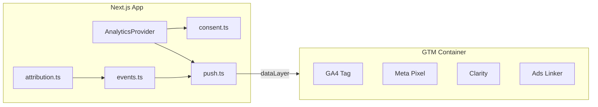

# Implementation Plan: Analytics System (GTM-First)

## Overview

Replace direct GA4 + Facebook Pixel loading with a GTM-first, region-aware, PII-safe analytics layer. Implementation follows TDD: unit tests for consent/events/attribution first, then UI integration, then targeted event wiring, then GTM handoff docs and E2E verification.

**Spec:** [`analytics-spec.md`](./analytics-spec.md)

---

## Architecture Decisions

- **Single choke point:** `pushToDataLayer()` sanitizes and pushes all events.
- **Consent before GTM:** `AnalyticsProvider` reads region + stored preferences before injecting GTM `next/script`.
- **No tool IDs in app:** GA4, Meta, Clarity configured only in GTM; app documents setup in `gtm-setup-checklist.md`.
- **Vertical slices:** Each phase leaves the app buildable; legacy components removed only after replacement is wired.



---

## Task List

### Phase 1: Foundation (contract + tests)

- [ ] **Task 1: Analytics types and event builders**
  - **Description:** Create `src/lib/analytics/types.ts` and `events.ts` with typed, PII-safe builders for all taxonomy events in the spec.
  - **Acceptance:**
    - [ ] Builders exist for: `page_view`, `generate_lead`, `form_start`, `form_submit`, `form_attempt`, `file_download`, `click_to_call`, `click_to_email`, `click_to_whatsapp`, `outbound_click`, `language_change`, `consent_default`, `consent_update`
    - [ ] Builders reject or strip forbidden keys (`email`, `phone`, `name`, `message`, `user_agent`, `error_stack`)
    - [ ] Unit tests cover happy path + PII rejection for each builder
  - **Verify:** `pnpm test -- src/lib/analytics/events.test.ts`
  - **Dependencies:** None
  - **Files:**
    - `src/lib/analytics/types.ts`
    - `src/lib/analytics/events.ts`
    - `src/lib/analytics/events.test.ts`
  - **Scope:** M (3 files)

- [ ] **Task 2: dataLayer push wrapper**
  - **Description:** Implement `push.ts` with `pushToDataLayer`, `initDataLayer`, and dev-only logging.
  - **Acceptance:**
    - [ ] No-op when `window` undefined (SSR safe)
    - [ ] Initializes `window.dataLayer` array if missing
    - [ ] Runs sanitization before push
    - [ ] Tests mock `window.dataLayer` and assert pushed payloads
  - **Verify:** `pnpm test -- src/lib/analytics/push.test.ts`
  - **Dependencies:** Task 1
  - **Files:**
    - `src/lib/analytics/push.ts`
    - `src/lib/analytics/push.test.ts`
    - `src/lib/analytics/index.ts`
  - **Scope:** S (3 files)

- [ ] **Task 3: Consent region resolver**
  - **Description:** Implement `consent.ts` with Vercel country header parsing, region buckets (`general`, `regulated`, `unknown`), default consent states, and `localStorage` read/write for `mq-analytics-consent-v1`.
  - **Acceptance:**
    - [ ] BD → `general` bucket with default analytics+ads allowed
    - [ ] EEA/UK/CH ISO codes → `regulated` with default denied
    - [ ] Missing country → `unknown` treated as regulated
    - [ ] `getEffectiveConsent()` merges region defaults + stored preferences
    - [ ] `shouldLoadGtm()` true when analytics OR advertising allowed
    - [ ] Unit tests for each bucket + stored override
  - **Verify:** `pnpm test -- src/lib/analytics/consent.test.ts`
  - **Dependencies:** None (parallel with Task 1)
  - **Files:**
    - `src/lib/analytics/consent.ts`
    - `src/lib/analytics/consent.test.ts`
    - `src/lib/analytics/regions.ts` (ISO lists)
  - **Scope:** M (3–4 files)

- [ ] **Task 4: Attribution persistence**
  - **Description:** Implement `attribution.ts` to capture UTM params and `gclid`/`fbclid` from URL on allowed visits; persist first/last touch in `sessionStorage`; expose `getAttributionForEvent()` and `getAttributionForSubmission()`.
  - **Acceptance:**
    - [ ] Persists only when `canPersistAttribution(consent, region)` is true
    - [ ] Stores booleans for click IDs (`gclid_present`, `fbclid_present`), not raw IDs in analytics events if policy prefers — **or** stores raw IDs only in internal submission payload (document choice in code comment; spec allows both with consent)
    - [ ] First-touch preserved; last-touch updated on new campaign params
    - [ ] Unit tests for allow/deny paths and first/last touch logic
  - **Verify:** `pnpm test -- src/lib/analytics/attribution.test.ts`
  - **Dependencies:** Task 3
  - **Files:**
    - `src/lib/analytics/attribution.ts`
    - `src/lib/analytics/attribution.test.ts`
  - **Scope:** M (2 files)

### Checkpoint: Foundation

- [ ] All `src/lib/analytics/*.test.ts` pass
- [ ] `pnpm lint` clean on new files
- [ ] No changes to layout yet — app behavior unchanged

---

### Phase 2: Provider + consent UI

- [ ] **Task 5: AnalyticsProvider + GTM script**
  - **Description:** Create `AnalyticsProvider` that: resolves consent on mount, pushes `consent_default`/`consent_update`, loads GTM via `next/script` when allowed, emits `page_view` on route changes.
  - **Acceptance:**
    - [ ] GTM script not rendered when both analytics and ads denied
    - [ ] GTM loads when either category allowed
    - [ ] `page_view` includes `locale` from pathname segment
    - [ ] Reads `NEXT_PUBLIC_GTM_ID`; no-ops with dev warning if unset
    - [ ] Includes GTM noscript iframe when loaded
  - **Verify:** `pnpm test` + manual `pnpm dev` with mock GTM ID
  - **Dependencies:** Tasks 2, 3, 4
  - **Files:**
    - `src/components/analytics/analytics-provider.tsx`
    - `src/components/analytics/analytics-provider.test.tsx` (if feasible with RTL)
  - **Scope:** M (2 files)

- [ ] **Task 6: Bilingual consent banner + preferences**
  - **Description:** Replace imperative DOM banner with React `ConsentBanner` + preference modal (analytics / advertising toggles). Add footer “Cookie preferences” reopen hook.
  - **Acceptance:**
    - [ ] Bengali + English copy via `next-intl` keys in `messages/*.json`
    - [ ] Accept all / Reject non-essential / Manage preferences flows work
    - [ ] Saves to `mq-analytics-consent-v1` and triggers `consent_update` + GTM load/unload behavior
    - [ ] Links to `/[locale]/privacy-policy` and `/[locale]/cookie-policy`
    - [ ] Regulated users see opt-in; general users see notice with preferences access
  - **Verify:** Manual locale switch + banner interaction; `pnpm test` for consent state handlers
  - **Dependencies:** Task 5
  - **Files:**
    - `src/components/analytics/consent-banner.tsx`
    - `messages/bengali.json`, `messages/english.json`
    - `src/components/layout/footer.tsx` (preferences link)
  - **Scope:** M (4 files)

- [ ] **Task 7: Server geo hint for consent (Vercel)**
  - **Description:** Pass country code from server to client for first paint consent (avoid flash of wrong default). Use `headers().get('x-vercel-ip-country')` in root or locale layout; pass as prop to `AnalyticsProvider`.
  - **Acceptance:**
    - [ ] Country available on first client render for consent default
    - [ ] Falls back to `unknown` locally and in non-Vercel dev
    - [ ] Test: mock header in unit test for resolver integration
  - **Verify:** `pnpm test` + dev inspection of consent default
  - **Dependencies:** Task 3, Task 5
  - **Files:**
    - `src/app/layout.tsx` or thin server wrapper
    - `src/lib/analytics/consent.ts` (accept initial country prop)
  - **Scope:** S (2 files)

- [ ] **Task 8: Replace legacy layout analytics**
  - **Description:** Remove `GoogleAnalytics`, `FacebookPixel`, `CookieConsent`, `InteractionTracker` from `src/app/layout.tsx`; mount `AnalyticsProvider` + `ConsentBanner`.
  - **Acceptance:**
    - [ ] No direct gtag/fbq scripts in layout
    - [ ] `PageErrorBoundary` still works; error tracking moved to optional `exception` event without stack in production payloads
    - [ ] Build succeeds
  - **Verify:** `pnpm build`
  - **Dependencies:** Tasks 5, 6, 7
  - **Files:**
    - `src/app/layout.tsx`
    - Delete or deprecate: `google-analytics.tsx`, `facebook-pixel.tsx`
    - Refactor: `src/components/error-boundary.tsx` (use new push API)
  - **Scope:** M (4–5 files)

### Checkpoint: Provider

- [ ] GTM stub loads in dev with test ID
- [ ] Consent banner renders in both locales
- [ ] `pnpm build` passes
- [ ] Legacy analytics files unused or removed

---

### Phase 3: Event wiring (funnel)

- [ ] **Task 9: Pre-admission funnel events**
  - **Description:** Wire `form_start` on first interaction; `generate_lead` on Sheets success only; `form_submit` with `success: false` on failure.
  - **Acceptance:**
    - [ ] No event on validation-only failure before submit
    - [ ] `generate_lead` includes `form_type: pre_admission`, locale, page_path, optional program_category, attribution
    - [ ] Tests mock successful/failed `submitToGoogleSheets` responses
  - **Verify:** `pnpm test` + manual form submit against test sheet
  - **Dependencies:** Task 8
  - **Files:**
    - `src/components/forms/pre-admission-form.tsx`
    - `src/lib/analytics/hooks/use-form-analytics.ts` (optional small hook)
  - **Scope:** M (2–3 files)

- [ ] **Task 10: Contact and inquiry attempt events**
  - **Description:** Wire `form_start` and `form_attempt` for contact form types and the admissions page inquiry form (`important-dates-section.tsx`); explicitly **no** `generate_lead` on simulated success.
  - **Acceptance:**
    - [ ] Events include `form_type`: `contact_general` | `contact_admission` | `contact_feedback` | `admission_inquiry`
    - [ ] Success UI does not push `generate_lead`
    - [ ] Comment in code notes backend prerequisite for future conversion
  - **Verify:** `pnpm test` or component test on submit handler
  - **Dependencies:** Task 8
  - **Files:**
    - `src/components/contact/contact-forms.tsx`
    - `src/components/admissions/important-dates-section.tsx`
  - **Scope:** S (2 files)

- [ ] **Task 11: Download tracking**
  - **Description:** Fire `file_download` from prospectus, curriculum, and code-of-conduct download actions after successful blob fetch.
  - **Acceptance:**
    - [ ] `file_category` values match spec
    - [ ] No event on fetch error
    - [ ] Code-of-conduct link in pre-admission form tracked
  - **Verify:** Unit test on handler; manual download check
  - **Dependencies:** Task 8
  - **Files:**
    - `src/components/ui/prospectus-download.tsx`
    - `src/components/ui/curriculum-download.tsx`
    - `src/components/forms/pre-admission-form.tsx` (code of conduct link)
  - **Scope:** S (3 files)

- [ ] **Task 12: CTA + language + outbound tracking**
  - **Description:** Targeted handlers for `tel:`, `mailto:`, WhatsApp component, outbound book link, `LanguageToggle`, admission banner CTA (as `cta_source`).
  - **Acceptance:**
    - [ ] `click_to_call`, `click_to_email`, `click_to_whatsapp`, `outbound_click`, `language_change` fire with `cta_location` where applicable
    - [ ] No global document click listener
    - [ ] Admission banner click tracked before navigation
  - **Verify:** `pnpm test` for pure handlers; manual click verification
  - **Dependencies:** Task 8
  - **Files:**
    - `src/components/language-toggle.tsx`
    - `src/components/ui/whatsapp-support.tsx`
    - `src/components/layout/header.tsx`
    - `src/components/layout/admission-banner.tsx`
    - `src/components/layout/footer.tsx`
  - **Scope:** M (5 files)

- [ ] **Task 13: Internal attribution on Sheets submission**
  - **Description:** When attribution allowed, append safe fields to pre-admission submission metadata sent to `/api/submit-form` (new optional columns or JSON field — coordinate with Sheets headers script).
  - **Acceptance:**
    - [ ] Attribution omitted when consent denies persistence
    - [ ] No PII in attribution fields
    - [ ] Document new sheet columns in `GOOGLE_SHEETS_SETUP.md` or analytics docs
  - **Verify:** `pnpm test:sheets` or unit test on payload builder
  - **Dependencies:** Task 4, Task 9
  - **Files:**
    - `src/lib/google-sheets.ts`
    - `src/app/api/submit-form/route.ts`
    - `scripts/setup-google-sheets-headers.js` (if new columns)
  - **Scope:** M (3 files)

### Checkpoint: Funnel

- [ ] `dataLayer` shows `generate_lead` on real pre-admission success
- [ ] Contact form does not emit `generate_lead`
- [ ] Downloads and CTA events fire on user actions
- [ ] `pnpm test` passes

---

### Phase 4: Privacy UX + Clarity

- [ ] **Task 14: Bilingual policy pages**
  - **Description:** Add `/[locale]/privacy-policy` and `/[locale]/cookie-policy` with bilingual content covering GTM, GA4, Meta, Clarity, children’s data, and preference instructions.
  - **Acceptance:**
    - [ ] Routes resolve for `bengali` and `english`
    - [ ] Linked from consent banner and footer
    - [ ] Legal review placeholder present
  - **Verify:** `pnpm build`; visit both locales
  - **Dependencies:** Task 6
  - **Files:**
    - `src/app/[locale]/privacy-policy/page.tsx`
    - `src/app/[locale]/cookie-policy/page.tsx`
    - `messages/bengali.json`, `messages/english.json`
  - **Scope:** M (4 files)

- [ ] **Task 15: Clarity form masking**
  - **Description:** Add `data-clarity-mask="true"` (or Clarity mask class) on pre-admission form container, contact form containers, and sensitive field wrappers.
  - **Acceptance:**
    - [ ] Mask attributes on all form sections in spec
    - [ ] Document verification steps in GTM checklist
  - **Verify:** Inspect DOM on `/pre-admission` and `/contact`
  - **Dependencies:** Task 8
  - **Files:**
    - `src/components/forms/pre-admission-form.tsx`
    - `src/components/contact/contact-forms.tsx`
    - Optional: `src/components/analytics/clarity-mask.tsx`
  - **Scope:** S (2–3 files)

### Checkpoint: Privacy

- [ ] Policy URLs return 200
- [ ] Form areas have clarity mask attributes
- [ ] Consent banner links work

---

### Phase 5: Cleanup + handoff + E2E

- [ ] **Task 16: Remove legacy analytics module**
  - **Description:** Delete unused `src/lib/analytics.ts`, `google-analytics.tsx`, `facebook-pixel.tsx`, `use-performance-monitoring.ts` analytics paths; update `.env.local.example` to GTM-only contract.
  - **Acceptance:**
    - [ ] No imports of old module remain
    - [ ] `.env.local.example` lists `NEXT_PUBLIC_GTM_ID`; deprecated GA/FB/Clarity app vars removed or marked GTM-only
    - [ ] README analytics section updated
  - **Verify:** `pnpm build` + `rg "initializeAllAnalytics|NEXT_PUBLIC_GA_MEASUREMENT_ID" src/`
  - **Dependencies:** Tasks 8–15
  - **Files:**
    - `src/lib/analytics.ts` (delete)
    - `.env.local.example`
    - `README.md`
  - **Scope:** S (3–4 files)

- [ ] **Task 17: GTM setup checklist (marketer handoff)**
  - **Description:** Write `docs/analytics/gtm-setup-checklist.md` with step-by-step GTM UI instructions: consent variables, tags, triggers, GA4 key events, Meta standard events, Clarity, Google Ads linker, Preview mode verification.
  - **Acceptance:**
    - [ ] Checklist matches event taxonomy in spec
    - [ ] Includes Test Events / DebugView / Clarity verification steps
    - [ ] Lists all Data Layer Variables needed
  - **Verify:** Peer review against `analytics-spec.md`
  - **Dependencies:** All event names finalized in Task 1
  - **Files:**
    - `docs/analytics/gtm-setup-checklist.md`
  - **Scope:** S (1 file)

- [ ] **Task 18: Playwright analytics smoke tests**
  - **Description:** Add `e2e/analytics.spec.ts` that stubs `dataLayer`, sets geo cookie/header mock if needed, asserts consent banner for regulated default, and `page_view` on navigation.
  - **Acceptance:**
    - [ ] Tests run in CI via `pnpm test:e2e`
    - [ ] No dependency on real GTM ID
    - [ ] At least: banner visible path, page_view pushed, no gtag global from legacy code
  - **Verify:** `pnpm test:e2e -- analytics`
  - **Dependencies:** Task 8
  - **Files:**
    - `e2e/analytics.spec.ts`
    - `playwright.config.ts` (if fixtures needed)
  - **Scope:** S (1–2 files)

### Checkpoint: Complete

- [ ] All acceptance criteria in spec met
- [ ] `pnpm test`, `pnpm lint`, `pnpm build`, `pnpm test:e2e` pass
- [ ] GTM checklist ready for marketer
- [ ] Ready for PR review

---

## Risks and Mitigations

| Risk | Impact | Mitigation |
|------|--------|------------|
| GTM not configured before deploy | High — no data in GA4/Meta | Block prod enable until checklist signed off; dev can use GTM Preview |
| Geo header missing locally | Medium — always regulated fallback | Document dev override; test on Vercel preview |
| Double counting during migration | Medium | Remove legacy scripts in same PR as GTM go-live |
| Clarity records form PII | High | Mask containers + verify in Clarity before marketing use |
| Sheets column mismatch for attribution | Medium | Task 13 coordinates with headers script |
| Contact form backend added later | Low | Spec already defines `generate_lead` gate; add Task 19 when backend ships |

---

## Parallelization

| Parallel safe | Sequential required |
|---------------|---------------------|
| Task 1 + Task 3 | Task 5 after 1–4 |
| Task 14 while 9–12 in progress | Task 8 before funnel wiring |
| Task 17 after Task 1 event names frozen | Task 16 after all wiring |

---

## Future Task (v2 — not in v1 scope)

- [ ] **Task 19: Enhanced matching** — hashed email/phone after legal approval, explicit marketing consent, and spec update.

---

## Verification Commands (final gate)

```bash
pnpm test
pnpm lint
pnpm build
pnpm test:e2e -- analytics
```

Manual pre-launch:

1. GTM Preview → confirm tags fire on `page_view`, `generate_lead`, `file_download`
2. GA4 DebugView → confirm key event `generate_lead`
3. Meta Test Events → confirm `SubmitApplication`
4. Clarity → confirm masks on form pages
5. Regulated VPN/country → confirm opt-in required before GTM loads
